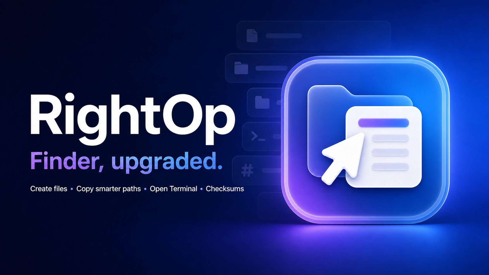

# RightOp



[](https://github.com/vlyl/rightop/actions/workflows/ci.yml)
[](https://github.com/vlyl/rightop/releases/latest)

RightOp is a source-available macOS Finder Sync extension that adds practical
file operations directly to Finder's context menu. It is a native SwiftUI +
AppKit project with no third-party runtime dependencies.

The product direction was inspired by the breadth of
[iRightMouse](https://www.better365.cn/irightmouse.html), but the interface,
implementation, icon, and source in this repository are original.

## Included actions

- Always-visible full-path copying, plus containing-directory paths, names, or shell-escaped paths
- Open the current directory in Terminal, iTerm2, or Warp
- Create uniquely named `.txt` and `.md` files in the current folder
- Hide or unhide selected items
- Copy SHA-256 or MD5 checksums
- Permanently delete selected items, with confirmation enabled by default

Copy Path is always available; every optional action can be enabled or disabled
in the containing app. The Finder menu reads the shared preference each time it
opens.

RightOp intentionally leaves native operations—such as Open With, Share/AirDrop,
Duplicate, and New Folder with Selection—to Finder.

## Requirements

- macOS 13 or later
- Apple silicon or Intel Mac

Building from source additionally requires Xcode 16 or later.

An Apple account is **not required** to build and use RightOp on your own Mac.
The local-build script uses an ad-hoc signature, preserving the sandbox and App
Group entitlements needed by the app and Finder extension.

## Install from a DMG

1. Download or build `RightOp-1.0.dmg`.
2. Double-click the DMG to mount it.
3. Drag **RightOp.app** onto the **Applications** shortcut.
4. Eject the `RightOp 1.0` disk image.
5. Open RightOp from Applications.
6. Click **Enable Extension** and switch RightOp on in macOS Settings.
7. Click **Choose Folder** and authorize your Home folder. Add external volumes
   separately if you want file-changing actions there.
8. Right-click a file, folder, or empty space in Finder. RightOp's enabled
   actions appear directly after Finder's built-in actions.

This local release is ad-hoc signed and is not Apple-notarized. If macOS blocks
the first launch, try opening RightOp once, then go to **System Settings →
Privacy & Security**, scroll to **Security**, and choose **Open Anyway** only
if you obtained the DMG from a source you trust.

Keep RightOp in `/Applications` after enabling the extension so Finder always
uses the same extension path.

## Build locally without an Apple account

From Terminal, run:

```sh
cd /path/to/rightop
./Scripts/build-local.sh
```

The signed application is created at `dist/RightOp.app`.

To build the compressed DMG—including an Applications shortcut and the license—
run:

```sh
./Scripts/create-dmg.sh
```

If Finder has cached an older development build, disable and re-enable RightOp,
or run:

```sh
pluginkit -r /path/to/old/RightOp.app
pluginkit -a /path/to/new/RightOp.app
killall Finder
```

Only run those commands against paths you have verified.

## Build with an Apple development team

This is optional for local use. If you later join the Apple Developer Program:

1. Open `RightOp.xcodeproj` in Xcode.
2. Select your development team for both the **RightOp** and
   **RightOpFinderExtension** targets.
3. If your team already owns different identifiers, change both bundle
   identifiers and the App Group. Keep the App Group identical in:
   - `Shared/AppConstants.swift`
   - `RightOp/RightOp.entitlements`
   - `RightOpFinderExtension/RightOpFinderExtension.entitlements`
4. Run the **RightOp** scheme.

## Tests

The file-naming, path-formatting, and checksum logic is also exposed as a small
Swift package:

```sh
swift test
```

The full application and Finder extension are built through Xcode:

```sh
xcodebuild \
  -project RightOp.xcodeproj \
  -scheme RightOp \
  -configuration Debug \
  build
```

## CI and releases

GitHub Actions runs the unit tests, builds the universal macOS app, verifies its
ad-hoc signature, and stores a downloadable application artifact for every push
to `main` and every pull request.

To publish a release, first update `CFBundleShortVersionString` in
`RightOp/Info.plist`, then push a matching tag. For example, app version `1.1`
accepts either `v1.1` or `v1.1.0`:

```sh
git tag v1.1.0
git push origin v1.1.0
```

The release workflow tests the code, creates and verifies the DMG, writes a
SHA-256 checksum, and uploads both files to the matching GitHub Release.
Dependabot checks the workflow actions for updates each week.

## Project structure

```text
RightOp/                  SwiftUI containing app and settings
RightOpFinderExtension/   Finder Sync menu and action handlers
Shared/                   Shared preferences and testable file utilities
Tests/                    Swift package tests for core logic
Artwork/                  Product banner and high-resolution app icon source
```

Finder Sync only offers menus inside registered directories. RightOp registers
the filesystem root so its menu is available in normal Finder locations and
mounted volumes. The extension remains sandboxed: operations that read or modify
contents only work inside folders the user has explicitly authorized. macOS
privacy controls and volume permissions still apply.

### Safety

“Permanently Delete” calls `FileManager.removeItem` and bypasses the Trash.
Confirmation is on by default and the action can be removed from the Finder menu
entirely. Disabling confirmation is intentionally possible for power users, but
it is not recommended.

## License

RightOp is licensed under the
[PolyForm Noncommercial License 1.0.0](LICENSE). Noncommercial use is permitted
under those terms. **Commercial use requires prior written permission and a
separate commercial license from the RightOp licensor.** Request commercial-use
permission through the [RightOp issue tracker](https://github.com/vlyl/rightop/issues).
